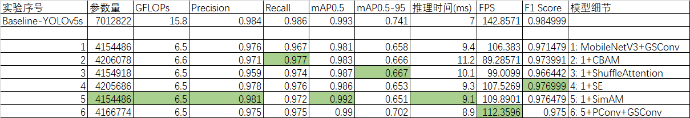

# KATS-ML-Filter
Machine learning filter for KATS based on improved YOLOv5

The major improvements I have made are to reduce the number of parameters and the computational cost of the real/bogus classifier.

## Experimental Environment:
OS: Windows 10

GPU: 8x Nvidia RTX3080 (CUDA 11.7, PyTorch 2.0)

CPU: Intel Xeon Platinum 8180

Batch size: 16

Epochs: 300

## Model Performances:

